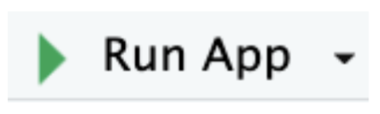

# Running MyFavoriteAlbums

1. Open RStudio. 
2. Navigate to the ```MyFavoriteAlbums``` folder. 
3. Locate and open the file named ```app.R``` by clicking on it. 

4. With ```app.R``` open in the editor, click the **Run App** button.


The application will launch in the viewer tab or in a separate browser window. 
