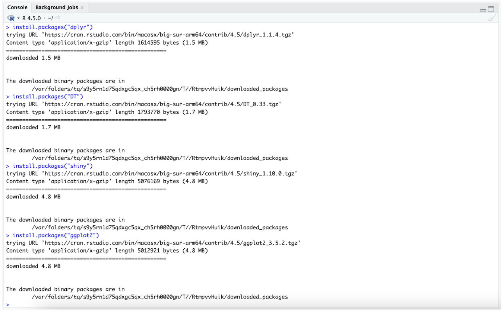

# Installing Required R Packages

Before running the MyFavoriteAlbums application, you will need to install some R packages. Packages are collections of R code that add extra features to help us work with data, build visualizations, and create web applications.

1. Open RStudio.
2. In the *Console* pane at the bottom, run the following commands:
```
install.packages("dplyr")
install.packages("DT")
install.packages("shiny")
install.packages("ggplot2")
```

These particular packages let you work with and transform data (```dplyr```), create interactive tables (```DT```), build user interfaces (```shiny```), and generate charts and graphs to visualize your results (```ggplot2```).



