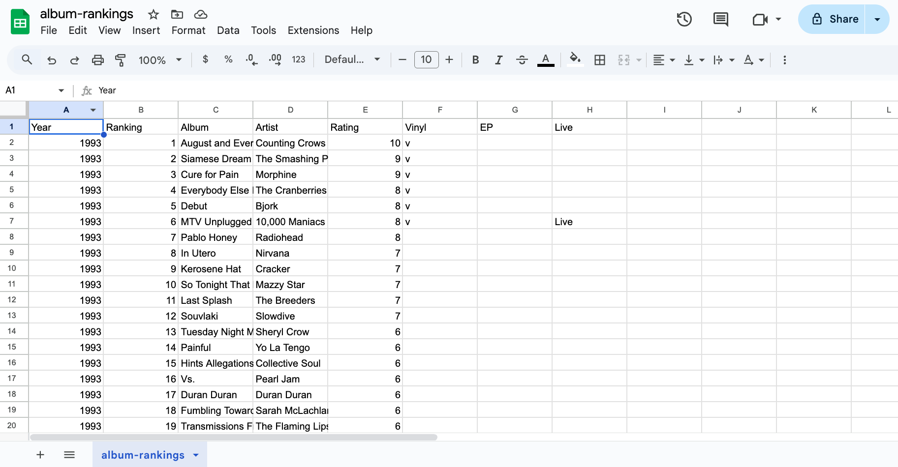

# What is a CSV File?

A CSV file, short for "comma-separated values", stores data in a simple table format, where each row contains a new data entry and each column is separated by a comma. These files use the ```.csv``` extension and are widely recognized for their compatibility across different software programs. Because of their straightforward structure, CSV files are ideal for sharing data between systems. Spreadsheet programs like Microsoft Excel or Google Sheets can open CSV files and display the data in a table, with each value placed neatly into its own cell for easy viewing and editing.

For example, here’s how the default ```album-rankings.csv``` file appears when opened in Google Sheets:

