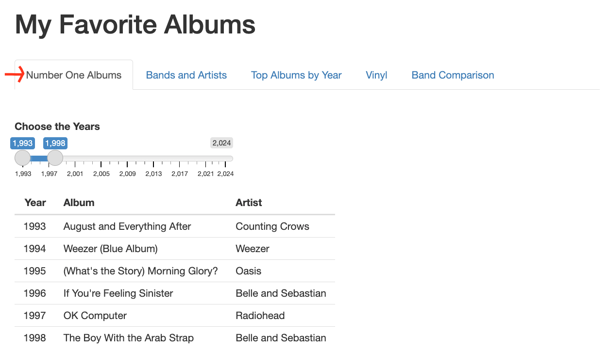

# Navigating MyFavoriteAlbums

Click on the tabs to explore different visualizations or summaries of your album data.

- **Number One Albums:** Displays your top-ranked album for each year within a selected time range.
    - Drag the ends of the slider to choose the start and end years you want to explore. The application automatically displays the highest-ranked album for each year in that range based on your album data.

- **Bands and Artists:** Displays a summary of albums you have ranked by a selected artist or band, including how many are in your collection and their average rating.
    - Use the dropdown menu to choose an artist or band from your collection. You can either scroll through the list or start typing the name to use the autocomplete feature for faster searching. The application displays a list of that artist’s or band’s albums, the total number of their albums you have ranked, and the average rating across those albums.

- **Top Albums By Year:** Displays a list of all albums from a selected year, sorted by your personal rankings.
    - Use the dropdown to choose a specific year. The application shows all albums you ranked for that year, listed from highest to lowest based on your personal rankings.

- **Vinyl:** The application automatically filters and displays a list of albums you do not own on vinyl and also a ranking of years, sorted from most to least, based on how many vinyl albums you own for that year (years with no vinyl albums are excluded). 

- **Band Comparison:** Compares two artists or bands based on your album data, showing how their albums stack up over time and by rating.
    - Use the dropdown menus to choose the two artists or bands you want to compare.  The application plots their albums on a graph with: 
        - X-axis: Release year.
        - Y-axis: Your personal rating. 
    
    If an artist or band has multiple albums: 
        - The first artist’s or band’s albums are connected with a red line.
        - The second artist’s or band’s albums are connected with a blue line.
