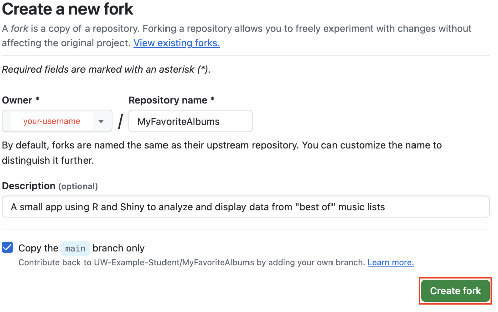

# Downloading MyFavoriteAlbums

1. [Log in](https://github.com/login) to your GitHub account.
2. Go to the [MyFavoriteAlbums GitHub repository](https://github.com/UW-Example-Student/MyFavoriteAlbums).
3. Click the **Fork** button.


4. On the *Create a new Fork* page, click the **Create fork** button. 

Once forked, you are taken to your version of the repository. 

5. Above the list of files, click the green **<> Code** button.
6. Once the dropdown menu appears, under “HTTPS”, click  to copy the URL for the repository.
 Code button and the copy button are located." width="500"/>

7. Open RStudio. 
8. From the *File* menu, choose **New Project → Version Control → Git**. 
    - Or, click the  button to create a new project, then select **Version Control → Git**.

9. Once the *New Project Wizard* window appears,
    1. Paste the repository URL you copied into the *Repository URL* field.
    2. In the *Project directory name* field, enter a name for your project (we will use ```MyFavoriteAlbums``` in this guide).
    3. Click the **Browse…** button to choose where on your computer you would like to save the project folder. 
    4. Click the **Create Project** button to finish setting up your new project.

    

These steps create a local copy of the MyFavoriteAlbums application that is linked to your GitHub repository. You can now open and edit the R files directly in RStudio.

