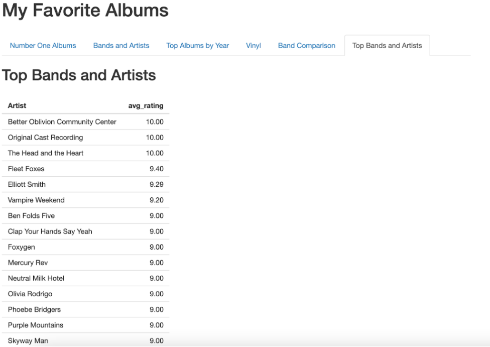

# Tutorial: Add a “Top Bands and Artists” Tab to Your MyFavoriteAlbums

In this tutorial, you will add a new tab to your application that lists the top-rated bands and artists (average rating of 9 or more) and gain practice writing R functions, connecting files, and updating Shiny server and UI components.

## Table of Contents
1. [Create a New R Script: top_bands.R](#one)
2. [Load Required Libraries](#two)
3. [Load the Album Data](#three)
4. [Write the top_bands() Function](#four)
5. [Connect top_bands.R to Your MyFavoriteAlbums](#five)
6. [Update the Server Logic](#six)
7. [Add the New Tab to the UI](#seven)
8. [Save and Run Your Updated Application](#eight)
9. [Push Your Changes to GitHub](#nine)

<hr>

<a id="one"></a>

## Create a New R Script: ```top_bands.R```
You will now create a helper script that contains the function for calculating the top bands and artists based on their average album ratings.

To create a new R script file:
1. In RStudio, go to the *File* menu and select **New File → R Script**. A new, blank script tab will open. 
2. Save the file to the ```MyFavoriteAlbums``` folder with the name: ```top_bands.R```.

```
.
└── MyFavoriteAlbums/
    ├── vinyl.R   
    ├── top_bands.R
    ├── number_one_albums.R
    ├── data/
        └── album-rankings.csv
    ├── compare_bands.R
    ├── app_ui.R
    ├── app_server.R
    ├── app.R
    ├── albums_by_year.R
    ├── albums_by_band.R
    └── README.md
```
<a id="two"></a>

## Load Required Libraries
At the top of your ```top_bands.R``` file, you might include the following line to load the ```dplyr``` package, which is widely used for data manipulation tasks like filtering, grouping, and summarizing, and the ```DT``` package for displaying interactive tables:

```
library(dplyr)
library(DT)
```
But do you always need to load these in this script?

When to include ```library(dplyr)``` and ```library(DT)``` in ```top_bands.R```: 
- If you plan to run this script by itself outside of the application. 
- If you are not sure whether the packages are loaded earlier in your application. 
- If the file is sourced before these packages are loaded elsewhere. 

Common Practice: In many R projects, it is a good idea to load all required packages once—typically at the top of your ```app.R``` file. This keeps things organized and avoids loading the same package multiple times. If ```dplyr``` and ```DT``` are already loaded in ```app.R``` (or in a script sourced before ```top_bands.R```), then you can omit the ```library()``` calls in ```top_bands.R```.

In summary, keep track of all package dependencies in one place when possible (usually ```app.R```). But if you are just experimenting or unsure, it is totally fine to include the ```library()``` lines for now.

<a id="three"></a>

## Load the Album Data

Next, write a line to load the CSV file containing your personal album data:
```
album_data <- read.csv("data/album-rankings.csv")
```

<a id="four"></a>

## Write the ```top_bands()``` Function
Now that you have read in the data, it is time to write a function that will calculate which bands and artists have the highest average album ratings. Type the following inside your ```tops_bands.R``` file: 
```
top_bands <- function(){
  album_data %>%
    group_by(Artist) %>%
    summarise(avg_rating = mean(Rating)) %>%
    filter(avg_rating >= 9) %>%
    arrange(desc(avg_rating))
}
```
Then, save the file.

Let us break this down:
- ```album_data %>%``` — Take the dataset and pipe it through the next commands.
- ```group_by(Artist)``` — Group rows by artist name. 
- ```summarise(avg_rating = mean(Rating))``` — Calculate the average rating per artist. 
- ```filter(avg_rating >= 9)``` — Keep only artists with an average rating of 9 or higher. 
- ```arrange(desc(avg_rating))``` — Sort the results from highest to lowest.

<a id="five"></a>

## Connect ```top_bands.R``` to Your MyFavoriteAlbums
Now that you have written the ```top_bands()``` function in its own script, you need to make it available to the rest of your application. 

To connect ```top_bands.R``` to the rest of the application:
1. Open the ```app.R``` file. 
2. Under the existing ```source()``` calls, add one for ```top_bands.R```:
```
source("top_bands.R")
```
3. Save the file.

<a id="six"></a>

## Update the Server Logic 
Next, you need to update your ```app_server.R``` file so that your app knows to use the new ```top_bands()``` function and display its results.

To update the server logic:
1. Open the ```app_server.R``` file. 
2. Scroll to the bottom of the ```server()``` function and add the following code:
```
output$text9 <- renderUI({
  HTML("<h2>Top Bands and Artists</h2><br>")
})
  
output$top_bands_table <- renderTable({
  return(top_bands())
})
```
3. Save the file.

The first part (```output$text9```) adds a heading above the table in the application. The second part (```output$top_bands_table```) runs your ```top_bands()``` function and displays the resulting table in the UI.

<a id="seven"></a>

## Add the New Tab to the UI
Now that your server knows what to do, it is time to update the UI so users can actually see the results. 

To update the UI:
1. Open the ```app_ui.R``` file. 
2. Find the ```tabsetPanel(...)``` section. This section is where all the tabs in your application are defined. 
3. Add the following code inside the ```tabsetPanel(...)``` (after ```id = "tabset"``` and preferably at the end, or wherever you would like the new tab to appear):
```
tabPanel("Top Bands and Artists",
            htmlOutput("text9"),
            tableOutput("top_bands_table")),
```
4. Save the file.

What this code does:
- Creates a new tab labeled “Top Bands and Artists”.
- Adds space for a heading (```text9```) and a table (```top_bands_table```) that will show the top-rated artists based on your album data. 

Once this is in place, your application’s interface will include the new tab and display the results when the application is run.

<a id="eight"></a>

## Save and Run Your Updated Application
Now that you have connected all the pieces, it is time to see it in action.

1. Save your changes in the following files: 
- ```top_bands.R```
- ```app_server.R```
- ```app_ui.R```
2. Run your application (as before).

When the app launches, you should now see a new tab labeled “Top Bands and Artists.” Inside the tab, you will find a table showing artists with an average album rating of 9 or higher, based on your dataset.



🎉 Congratulations! You have just added a brand-new feature to your MyFavoriteAlbums application. Keep experimenting to get even more comfortable with how the pieces work together.

<a id="nine"></a>

## Push Your Changes to GitHub
Once you have added the “Top Bands and Artists” tab and verified that it works locally, save your changes to your GitHub repository.

To push your changes to GitHub: 
1. In RStudio, go to the *Terminal* tab in the lower pane. (Tip: If you do not see the *Terminal* tab, go to **View → Move Focus to Terminal** to open it.)
2. Use the ```git add``` command to stage the files you want to include in your next commit. Enter this into the terminal:
```
git add .
```
The dot . means “all changed files”.
3. Use the ```git commit``` command to save a snapshot of your staged files along with a message describing what you did. Enter this into the terminal:
```
git commit -m "Add Top Bands and Artists Tab"
```
4. Use the ```git push``` command to send your committed changes to your GitHub repository. Enter this into the terminal:
```
git push
```

You have now saved and backed up your work on GitHub!