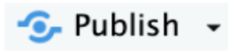
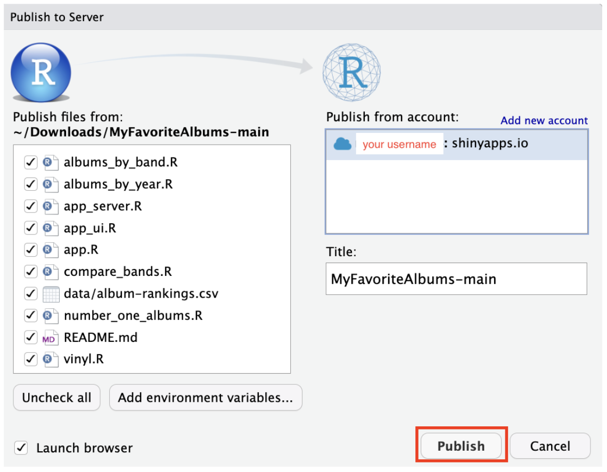

# (Optional) Publishing Your MyFavoriteAlbums Online

Once you have built and run your application locally, you can take it a step further and publish it online for others to see. 
1. [Sign up](http://shinyapps.io/admin/#/signup) for a free shinyapps.io account. Choose a unique account name during registration.
2. In RStudio, run the following command in the *Console* pane to install the package that lets you publish to shinyapps.io:
```
install.packages("rsconnect")
```
3. On shinyapps.io, under “STEP 2 – AUTHORIZE ACCOUNT”, click the green **Copy to Clipboard** button. 


4. Return to RStudio, paste the copied code into the *Console* pane, and press Enter to connect your account.
5. Run your application (as before).
6. Once your app is running in RStudio, click the **Publish** button.


7. When another window opens, make sure all listed files are checked, then click **Publish** again.


Your application will be live at: 

https://YOURUSERNAME.shinyapps.io/MyFavoriteAlbums-main/

You can now share the link and access your application from anywhere.
